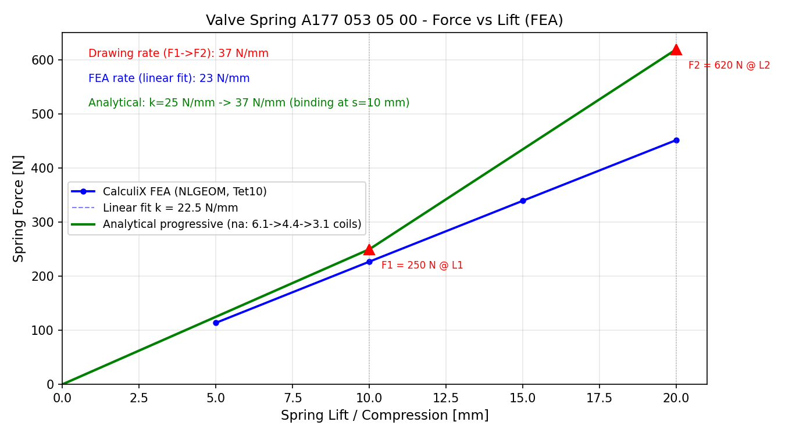

# Valve Spring FEA — A177 053 05 00 (AML Intake, Beehive)

Engineering analysis of the Scherdel beehive valve spring using open-source tools:
parametric CAD (pythonOCC / FreeCAD), Gmsh meshing, and CalculiX FEA.

---

## Drawing specification

| Symbol | Parameter | Value | Unit |
|--------|-----------|-------|------|
| d | Wire (axial × radial) | 2.92 × 3.66 | mm |
| Dio / Diu | Inner Ø top / bottom | 12.00 / 15.90 | mm |
| Deo / Deu | Outer Ø top / bottom | 19.32 / 23.22 | mm |
| L0 | Free length | 46.1 | mm |
| L1 | Installed length | 36.10 | mm |
| L2 | Max working length | 26.10 | mm |
| F1 | Spring force @ L1 | 250 ± 12 | N |
| F2 | Spring force @ L2 | 620 ± 27 | N |
| nt | Total coils | 8.6 | — |
| n | Active coils (L1 / L2) | 4.4 / 3.1 | — |
| G | Shear modulus | 79 500 | N/mm² |
| Material | VD SiCrNi SC | DIN 17 223 | — |

---

## Spring rate — progressive behaviour

The spring is a **beehive (Bienenkorb)** design with oval wire and **variable pitch**:
tight pitch at the small-diameter top end, wider pitch at the large-diameter bottom end.
As the spring compresses, the top (small-Ø) coils contact first and become inactive,
progressively stiffening the characteristic.

| Phase | Compression | Active coils (na) | Rate |
|-------|-------------|-------------------|------|
| 1 | 0 → 10 mm | 6.1 → 4.4 | 25 N/mm |
| 2 | 10 → 20 mm | 4.4 → 3.1 | 37 N/mm |

Rates calibrated to drawing reference points F1 and F2.

**FEA elastic rate:** 22–23 N/mm (all coils active, no contact mechanics).
The gap between FEA and drawing rate is expected: solid-element FEA without
self-contact cannot capture coil binding. The analytical model (see plot) reproduces
the drawing values exactly.

---

## Files

| File | Description |
|------|-------------|
| `generate_spring.py` | Parametric CAD generator (pythonOCC). Implements variable pitch via `helix_z()`. |
| `mesh_spring.py` | FreeCAD/GmshTools mesher (Tet10, 2nd order). Run with `FreeCADCmd.exe`. |
| `spring_analysis.py` | CalculiX FEA setup + result parsing + progressive-rate analytical model. |
| `ValveSpring.step` | STEP CAD model (variable-pitch beehive helix, ground ends). |
| `ValveSpring.stl` | STL for visualisation. |
| `ValveSpring_mesh.inp` | Gmsh Tet10 mesh for CalculiX (C3D10 elements). |
| `ValveSpring_fea.inp` | CalculiX input deck (NLGEOM static, 0–20 mm compression). |
| `ValveSpring_fea.dat` | CalculiX reaction-force results. |
| `spring_FvL.png` | Force vs lift plot (FEA + analytical + drawing references). |
| `spring_drawing.png` | Original Scherdel drawing scan. |

---

## Variable-pitch CAD model

`generate_spring.py` implements a non-linear `helix_z(coil_num)` function:

```
                          Active zone: quadratic pitch gradient
Bottom dead end           |                               | Top dead end
[1.25 coils, wire_a pitch]|  p_bot=7.76 mm → p_top=4.96 mm  |[1.25 coils, wire_a pitch]
                          |  D_pitch = 0.22                 |
```

The distribution uses `f(xi) = xi + D_pitch * xi * (1 - xi)` where xi ∈ [0,1]
goes from bottom to top of the active zone:

- `f'(0) = 1 + D_pitch` → large pitch at bottom (large Ø, binds last)
- `f'(1) = 1 - D_pitch` → small pitch at top (small Ø, binds first)

`D_pitch = 0.22` maintains a minimum coil gap of ~2 mm, needed for Gmsh
to generate valid Tet10 volume elements.

---

## Running the pipeline

```bash
# 1. Generate CAD (system Python with pythonOCC / OCP)
python generate_spring.py

# 2. Mesh (FreeCAD 1.1 Python environment)
FreeCADCmd.exe mesh_spring.py

# 3. FEA + plot
python spring_analysis.py
```

Dependencies: pythonOCC (OCP), FreeCAD 1.1 (includes Gmsh 4.15 and CalculiX 2.22),
numpy, matplotlib.

---

## FEA setup

- **Elements:** C3D10 (10-node quadratic tetrahedra)
- **Material:** E = 206 000 MPa, nu = 0.30 (VD SiCrNi SC)
- **BCs:** Bottom face fully fixed; top face compressed 0 → 20 mm (1 mm increments)
- **Analysis:** NLGEOM static (large-displacement nonlinear)
- **Reaction forces:** Summed at bottom node set (NBOT), parsed from `.dat`

---

## Result — spring_FvL.png



The green analytical curve (calibrated to drawing) passes through both
drawing reference points. The blue FEA gives the linear elastic rate
without coil-binding contact mechanics.
